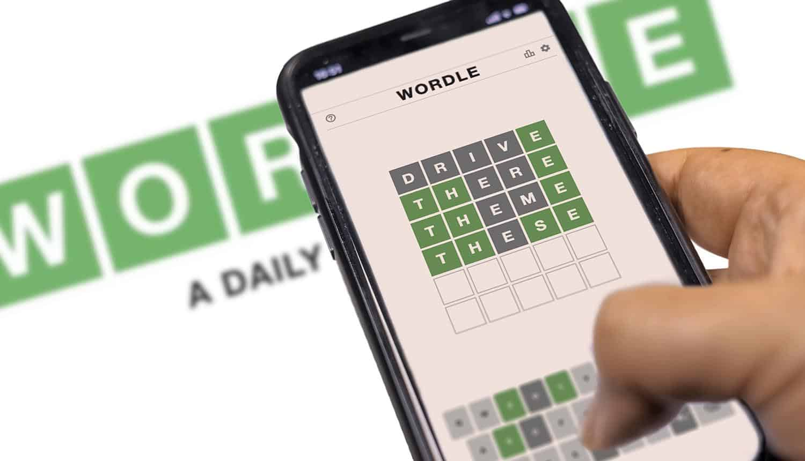

# Wordle Infinite 🧩



A premium, modern Wordle clone built with **Flutter**, **Firebase**, and **Material 3**. Play the world's favorite word game infinitely with real-time stats and cloud sync.

## 🚀 Key Features

- **∞ Infinite Gameplay**: No once-a-day limit. Play as many times as you want!
- **🔐 Google Authentication**: Securely sign in to save your history and sync across devices.
- **📊 Real-time Statistics**: Deep insights into your performance, including win rates and guess distribution, powered by **Firestore**.
- **✨ Premium UI/UX**:
  - Smooth 60FPS animations.
  - Dynamic **Dark/Light Mode** support.
  - High-fidelity visual feedback (Green/Yellow/Grey transitions).
- **⌨️ Custom Keyboard**: Intuitive, state-aware keyboard that tracks used letters.

## 📥 Getting Started

### Direct Download
You can download the latest release build for Android directly from the link below:

👉 **[Download Infinite Wordle APK](https://github.com/Suramyavns/wordle/releases/download/android/wordle-infinite.apk)**

### Build from Source

1. **Clone the Repo**:
   ```bash
   git clone https://github.com/Suramyavns/wordle.git
   ```
2. **Setup Firebase**:
   Configure your Firebase project and add `google-services.json`.
3. **Install Dependencies**:
   ```bash
   flutter pub get
   ```
4. **Run the App**:
   ```bash
   flutter run
   ```

## 🛠 Tech Stack

- **Framework**: [Flutter](https://flutter.dev)
- **Database**: [Cloud Firestore](https://firebase.google.com/docs/firestore)
- **Auth**: [Firebase Authentication](https://firebase.google.com/docs/auth)
- **State Management**: ValueNotifiers & StreamBuilders
- **Design System**: Material 3


